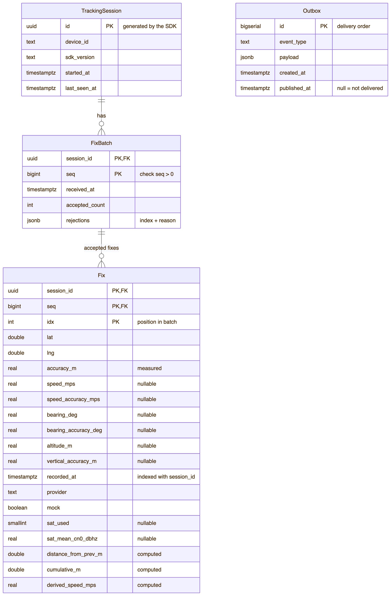
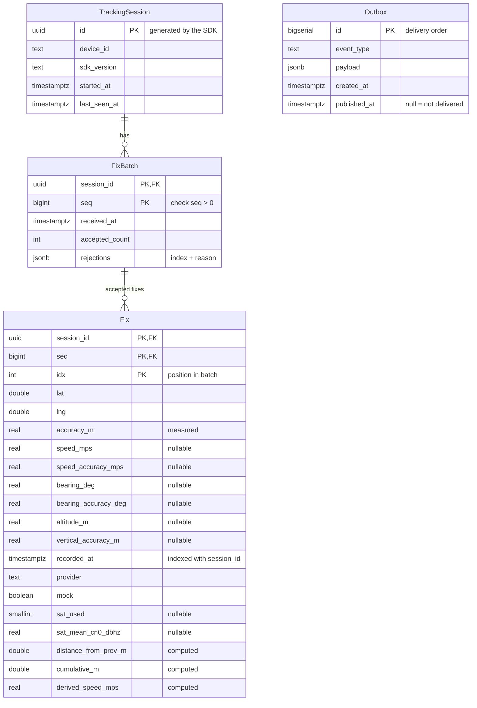

# Database Design

The server stores its data in PostgreSQL 16. Flyway migrations in
`app/src/main/resources/db/migration` create the tables, and Exposed code in each context's
`adapter/out/persistence` package reads and writes them. This page describes the tables that exist
after phase 2. Update it in the same pull request as every new migration.

Rules for changing the schema are in [conventions.md](conventions.md#persistence). The most important
one: a merged migration is never edited; a change always goes into a new `V<n>__...sql` file.

## Diagram



The diagram uses readable names. The table names in SQL are lowercase with underscores:

| In the diagram | Table in SQL |
|---|---|
| `TrackingSession` | `tracking_sessions` |
| `FixBatch` | `fix_batches` |
| `Fix` | `fixes` |
| `Outbox` | `outbox` |

A line with `||` on one end and `o{` on the other end means "exactly one on the `||` side, zero or
more on the `o{` side". `Outbox` has no line on purpose; see [The outbox](#the-outbox).

<details>
<summary>Diagram source (Mermaid). Edit this when a migration changes the tables, then export the image again.</summary>



</details>

## Tables

| Table | Owner | One row is | Written when | Migration |
|---|---|---|---|---|
| `tracking_sessions` | tracking | One tracking run of one phone | On `hello`; updated on every reconnect and every stored batch | V3 |
| `fix_batches` | tracking | One numbered upload (`seq`) of a session | Once per new `seq` | V3 |
| `fixes` | tracking | One GPS point that passed the fix pipeline | Together with its batch | V3 |
| `outbox` | platform | One event that waits for delivery | In the same transaction as the change that caused the event | V2 |

Only the owner's adapters read or write a table. Other contexts use the owner's events and public API,
never its tables (rule TC-0-ARCH-03 in `ArchitectureTest`).

### `tracking_sessions`

Who is sending, since when, and when the server last heard from the device. The SDK generates `id`
when tracking starts, so the same id survives reconnects. `device_id` and `started_at` never change
after the first insert; `sdk_version` and `last_seen_at` change on a reconnect.

### `fix_batches`

The receipt book of uploads. The primary key `(session_id, seq)` makes a resend harmless: a second
insert of the same pair stores nothing, and the server answers with the stored `accepted_count` and
`rejections`. `rejections` is a JSON array such as `[{"index": 3, "reason": "POOR_ACCURACY"}]`. It is
read only as a whole, so it does not need its own table.

### `fixes`

The track itself: where the vehicle was, when, and how far it had travelled. Rejected points are not
stored here; their index and reason are in `fix_batches.rejections`. A fix is identified by its batch
and its position in the batch, `(session_id, seq, idx)`, the same way the protocol identifies a point.
That triple is the primary key, so the biggest table needs no extra id column and no extra index.

### The outbox

`outbox` is a list of events that other parts of the system must receive, for example "the driver
moved". It holds no trip data of its own.

It solves the dual-write problem. After storing a batch, the server must also tell other contexts
about it. If the server stores first and then publishes, a crash between the two steps loses the
event. If it publishes first and then stores, a failed store leaves an event about data that does not
exist. With the outbox, the server writes the event as a row in the same transaction as the data:

```text
BEGIN
  INSERT INTO fix_batches ...      (seq 7, 9 accepted, 1 rejected)
  INSERT INTO fixes ...            (9 rows)
  UPDATE tracking_sessions ...     (last_seen_at)
  INSERT INTO outbox ...           ('tracking.FixesAccepted.v1', {the 9 positions})
COMMIT                             (all four, or none)
```

A relay (phase 3) reads the rows `WHERE published_at IS NULL` in `id` order, delivers each event, and
then sets `published_at`. If the server stops before it sets `published_at`, the relay delivers the
event again after the restart. So delivery is at least once, and every consumer must handle the same
event twice.

`outbox` has no foreign key, for three reasons:

- The link that matters is the transaction, not a key. A foreign key only guarantees that a
  referenced row exists. The outbox needs "saved together or not at all", and only the transaction
  gives that.
- The table belongs to the platform. Other contexts (trip, devicecontrol) write their own event types
  into it. A key to `fix_batches` would tie a shared table to one context.
- The rows have a different lifetime. Delivered events can be deleted soon; fixes are history. A key
  between them would block or cascade deletes on the other side.

The payload is a complete copy of what consumers need (session id, seq, positions), so a consumer
never reads tracking's tables. `event_type` contains a version (`.v1`); a change to the payload format
gets a new version.

## Keys and constraints

| Constraint | Protects |
|---|---|
| `fix_batches` primary key `(session_id, seq)` | Idempotent ingest: one stored copy per batch, also when two requests race |
| `CHECK (seq > 0)` | Repeats the service's `INVALID_SEQ` check, in case code skips it |
| `fix_batches.session_id` → `tracking_sessions.id` | No batch without its session |
| `fixes (session_id, seq)` → `fix_batches` | No fix without its batch |
| `fixes` primary key `(session_id, seq, idx)` | One row per point of a batch |

The application checks give clear error messages. The database constraints give correctness even
when the application has a bug.

## Indexes and the queries they serve

| Query (port method) | Index |
|---|---|
| Find a session by id (`TrackingSessionRepository.find`, `save`) | Primary key of `tracking_sessions` |
| Find a stored batch (`FixBatchRepository.find`) | Primary key `(session_id, seq)` |
| Highest stored seq (`FixBatchRepository.highestSeq`) | The same primary key, read backwards |
| Latest accepted fix at or before a time (`lastAcceptedAtOrBefore`) | `fixes_session_time (session_id, recorded_at)` |
| Fixes of a session in a time range (phase 3) | `fixes_session_time` |
| Undelivered events in order (phase 3 relay) | `outbox_unpublished (id) WHERE published_at IS NULL` |

There is no index on `tracking_sessions.device_id`, because no query needs it yet. An index is added
together with the first query that needs it, because every index slows down writes and uses space.
`outbox_unpublished` is a partial index: it contains only undelivered rows, so it stays small.

## Column types

- Times are `timestamptz`. It stores an instant, so the result does not depend on the time zone of
  the server or the database. Kotlin uses `kotlin.time.Instant`.
- Coordinates and computed distances are `double precision` (8 bytes).
- Values that the phone measured (accuracy, speed, bearing, altitude, signal strength) are `real`
  (4 bytes). A measurement like "8.5 m" is good to two or three digits, so the 7 significant digits of
  `real` are enough, and the biggest table needs less space.
- `rejections` and `payload` are `jsonb`, because they are always read and written as a whole.

## Size and open decisions

Assumption: 200 drivers, 1 fix per second each, 8 hours per day. That is about 5.8 million rows in
`fixes` per day, or roughly 1.3 GB per day with indexes. At this size, two decisions become
necessary (not decided yet):

- Retention: how long raw fixes are kept, and whether old fixes are summarised or deleted.
- Partitioning: whether `fixes` is split by month, so that old data can be dropped cheaply.

Delivered `outbox` rows also need a clean-up rule when the relay exists (phase 3).
